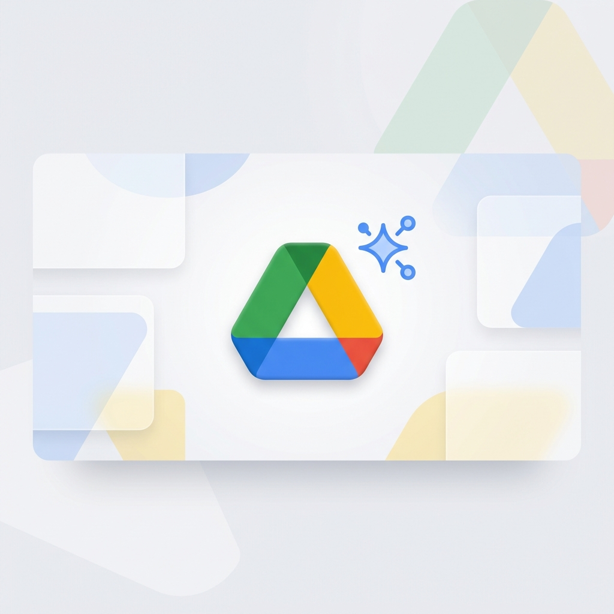

<div align="center">
  
  <h1>Intelligent Google Drive MCP</h1>
</div>

[](https://modelcontextprotocol.io)
[](https://opensource.org/licenses/MIT)
[](https://www.python.org/downloads/)

Transform your AI agent from a simple file explorer into an **Autonomous Power-User**. This isn't just a Google Drive connector; it's a cognitive layer for your cloud storage.

---

## 💎 The "Intelligent" Edge

Most MCP servers just list files. This one **reasons** about them.

| Feature             | Description                                               | Benefit                                                         |
| :------------------ | :-------------------------------------------------------- | :-------------------------------------------------------------- |
| **🔨 The Forge**     | On-the-fly Python "Skill" creation and execution.         | Solve complex tasks like "Archive all PDFs older than 30 days". |
| **🩹 Path Healing**  | Fuzzy, human-like path resolution (e.g., `/Work/Drafts`). | No more hunting for obscure File IDs.                           |
| **🧠 Auto-Recovery** | Intercepts 404s and suggests correct paths/files.         | Agent remains autonomous even when it makes mistakes.           |
| **🔍 Smart Read**    | Auto-detection of MIME types and content conversion.      | Seamless interaction with Sheets, Docs, and PDFs.               |
| **📜 Audit Log**     | Transparent tracking of all autonomous decisions.         | Complete visibility into what your agent is doing.              |

---

## 🛠 Features Breakdown

### 📂 Standard Operations
- **Discovery**: `list_files`, `search_files`, `list_folder`.
- **Management**: `create_folder`, `upload_file`, `trash_file`.
- **Metadata**: Deep metadata inspection for any file object.

### ⚡ The Forge (Agent Skills)
Empower your agent to expand its own capabilities. Using the [Agent Skills](https://agentskills.io) standard, the agent can:
- **`create_skill`**: Write Python logic to perform multi-step Drive operations.
- **`list_skills`**: Browse its library of forged capabilities.
- **`run_skill`**: Execute its custom logic with full API access.

### 🧭 Autonomous Navigation
- **`resolve_path`**: Converts `/Project/2026/Budget.xlsx` into a working ID, healing broken paths automatically.
- **`smart_read`**: A high-level tool that handles resolution, downloading, and decoding in one step.

---

## � Getting Started

### 1. Requirements
- Python 3.10 or higher.
- A Google Cloud Project with the **Drive API** enabled.

### 2. Deep Dive Into Setup
For a step-by-step walkthrough on generating your `credentials.json` and `token.json`, please refer to our:
👉 **[Comprehensive Setup Guide](docs/setup.md)**

### 3. Quick Configuration
Add this to your MCP host configuration (e.g., Antigravity):

```json
"google-drive": {
  "command": "python",
  "args": ["/path/to/server.py"],
  "env": {
    "GOOGLE_DRIVE_CREDENTIALS": "/path/to/credentials.json",
    "GOOGLE_DRIVE_HEADLESS_AUTH": "false",
    "GOOGLE_DRIVE_PYTHON_PATH": "/usr/bin/python3"
  }
}
```

#### ⚙️ Environment Variables
| Variable                     | Description                                       | Default              |
| :--------------------------- | :------------------------------------------------ | :------------------- |
| `GOOGLE_DRIVE_CREDENTIALS`   | Path to your `credentials.json`.                  | `./credentials.json` |
| `GOOGLE_DRIVE_HEADLESS_AUTH` | Set to `true` for console-based OAuth on servers. | `false`              |
| `GOOGLE_DRIVE_PYTHON_PATH`   | Path to a specific Python executable or venv.     | `sys.executable`     |
| `GOOGLE_DRIVE_SKILLS_DIR`    | Where to store forged AI Skills.                  | `./skills`           |

---

## 🛡️ Security Implications

**Please Read Carefully:**
This MCP server implements **The Forge**, which allows AI agents to write and execute arbitrary Python code on your machine. 
*   **Local Use Only**: This tool is designed for local power-users. 
*   **Sandbox**: It does not currently implement a sandbox for executed scripts. Only use it with agents you trust to handle your local filesystem.

---

## � Contributing & Extension

We believe in open autonomy. If you have ideas for new core skills or improvements to the path-healing engine:
1. Check the [Contributing Guide](CONTRIBUTING.md).
2. Explore the `skills/` directory for examples of forged logic.
3. Submit a PR!

---

## ⚖️ License

Distributed under the **MIT License**. See `LICENSE` for more information.

---
<p align="center">
  Built with ❤️ for the next generation of AI Agents.
</p>
